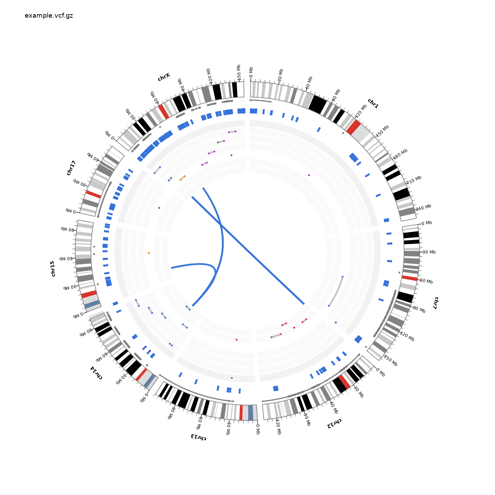
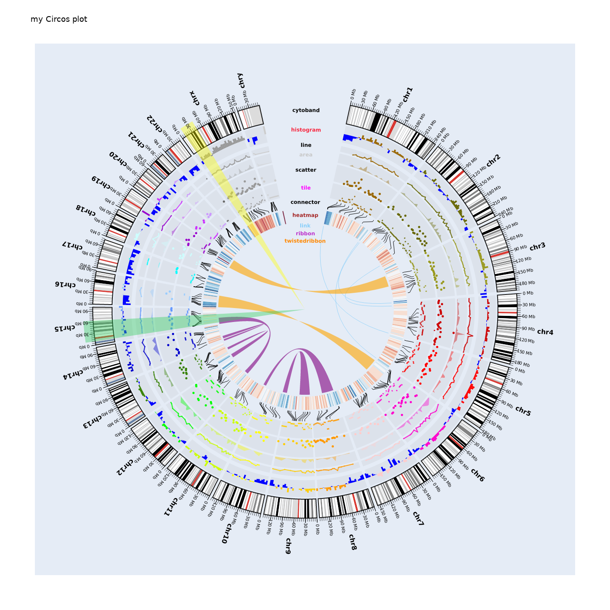

# Table of Contents

1. [Instroduction](#introduction)
1. [Examples](#examples)
    1. [Circos plot from VCF file](#circos-plot-from-vcf-file)
    1. [Circos plot from JSON file](#circos-plot-from-json-file)
1. [Installation](#installation)
    1. [Git clone](#git-clone)
    1. [Pip](#pip)
    1. [Docker](#docker)
1. [Usage](#usage)
    1. [Binary](#binary)
    1. [Docker](#docker-1)
    1. [Python](#python)
    1. [CloudGene](#cloudgene)
1. [Help](#help)
1. [Input](#hinput)
1. [Output](#output)
1. [Export](#export)
1. [Options](#options)
    1. [Options format](#options-format)
    1. [General section](#general-section)
    1. [Chromosomes section](#chromosomes-section)
    1. [Genes section](#genes-section)
    1. [Exons section](#exons-section)
    1. [Variants section](#variants-section)
    1. [Additonal annotations section](#additonal-annotations-section)
1. [Contacts](#contacts)


<br/>


# Introduction

Package vcf2circos is a python package based on Plotly which helps generating Circos plot, from a VCF file or a JSON configuration file.

See documentation and code in [GitHub vcf2circos](https://github.com/bioinfo-chru-strasbourg/vcf2circos).

This package is based on [PCircos](https://github.com/CJinnny/PCircos) code

<br/>


# Examples

## Circos plot from VCF file

[](demo_data/example.vcf.gz.png)

## Circos plot from JSON file

[](demo_data/demo_params.json.png)


<br/>

# Installation

## Git clone

Download package source files.

```
$ mkdir vcf2circos
$ cd vcf2circos
$ git clone https://github.com/bioinfo-chru-strasbourg/vcf2circos.git .
```

## Pip

Compile source using Pip to generate binary "vcf2circos"

```
$ python -m pip install -e .
```

## Docker

Build docker image "vcf2circos:latest"

```
$ docker-compose build
```


<br/>

# Usage

## Binary 

```
$ vcf2circos --input=demo_data/example.vcf.gz --output=/data/example.vcf.gz.html --options=demo_data/options.example.json

```

## Docker

```
$ docker run -v $(pwd):/data vcf2circos:latest --input=demo_data/example.vcf.gz --output=/data/example.vcf.gz.html --options=demo_data/options.example.json

```

## Python 

```
$ python vcf2circos/vcf2circos.py --input=demo_data/example.vcf.gz --output=/data/example.vcf.gz.html --options=demo_data/options.example.json

```

## CloudGene 

```
$ docker-compose build -d

```
And open URL [`http://localhost:8082`](http://localhost:8082) in a browser (admin account "admin"/"admin1978", see [CloudGene wibsite](http://docs.cloudgene.io/)). Run vcf2circos Application with a VCF file.


<br/>

# Help

```
usage: python vcf2circos.py [-h] -i INPUT -o OUTPUT [-e EXPORT] [-p OPTIONS]
                         [-n NOTEBOOK_MODE]

optional arguments:
  -h, --help            show this help message and exit
  -i INPUT, --input INPUT
                        Input file.
                        Format will be autodetected from file path.
                        Supported format:
                           'json', 'vcf'
  -o OUTPUT, --output OUTPUT
                        Output file.
                        Format will be autodetected from file path.
                        Supported format:
                           - html (dynamic): 'html'
                           - images: 'png', 'jpg', 'jpeg', 'webp', 'svg', 'pdf', 'eps'
                           - json (plotly): 'json'
  -e EXPORT, --export EXPORT
                        Export file.
                        Format is 'json'.
                        Generate json file from VCF input file
  -p OPTIONS, --options OPTIONS
                        Options file or string.
                        Format is 'json', either in a file or as a string.
  -n NOTEBOOK_MODE, --notebook_mode NOTEBOOK_MODE
                        Notebook mode.
                        Default False
```


<br/>

# Input

This package allows multiple input formats:
- VCF including SNV/InDel/SV (see [VCF specifications](https://samtools.github.io/hts-specs/VCFv4.2.pdf)). Header needs to contain contigs (in order of appearance). See [VCF example](demo_data/example.vcf.gz).
- JSON configuration file (see [PCircos](https://github.com/CJinnny/PCircos) documentation). See [JSON configuration example](demo_data/demo_params.json).

Format will be autodetected from file path.


<br/>

# Output

This package generates Circos plot in multiple formats (html, png, jpg, jpeg, webp, svg, pdf, eps, json):
- HTML file (format with customizable hover text). See [HTML example](demo_data/example.vcf.gz.html)
- Image files (i.e. png, jpg, jpeg, webp, svg, pdf, eps). See [PNG example](demo_data/example.vcf.gz.png) and [PDF example](demo_data/example.vcf.gz.pdf)
- JSON Plotly file (see [Plotly documentation](https://plotly.com/)). See [JSON plotly example](demo_data/example.vcf.gz.json)

Format will be autodetected from file path.

Output Circos plot sections from a VCF file:


<br/>

# Export

Circos plot generated from VCF file can be exported as JSON configuration file, for further use. See [JSON configuration export example](demo_data/example.vcf.gz.export.json)


<br/>

# Options 

Circos plot generated from a VCF file can be configured using a JSON options file. See [JSON options example](demo_data/options.example.json).

Here is an example of a JSON options file:
```
{
	"General": {
		"title": "",
		"width": 1400,
		"height": 1400,
		"plot_bgcolor": "white"
	},
	"Chromosomes": {
		"cytoband": "options.cytoband.data.path.infos.json",
		"list": ["chr7", "chr13", "chr12", "chr14", "chr15", "chrX", "chr1", "chr17"]
	},
	"Genes": {
		"data": "options.genes.data.path.json",
		"list" : ["targets", "EGFR", "BRCA1", "BRCA2", "TP53", "BBS1", "BBS2", "BBS4", "BBS5"],
		"only_snv_in_sv_genes": true
	},
	"Exons": {
		"data": "options.genes_exons.data.path.json",
		"show": false
	},
	"Variants": {
		"annotations": {
			"fields": ["chr", "pos", "ref", "alt", "nomen", "*"],
			"show_none": true
		},
		"rings": {
			"position": 0.50,
			"height": 0.04,
			"space": 0.01
		}
	},
	"Additonal_annotations": ["options.additional_annotations.ClinGen.json"]
}
```

<br/>

## Options format

Multiple sections define additional data to show in the Circos plot. These sections are in a JSON format, which can be defined directly on the corresponding section, or through a JSON file. Data can be either provided in a tab-telimited file, or in a JSON format. The contain of the data (columns) depend on data type (e.g. Cytoband, genes, exons). The following example refers to cytoband data.


Example of a external JSON file:
```
"Chromosomes": {
    "cytoband": "options.cytoband.data.path.infos.json"
}
```

Example of a JSON configuration, with an external data tab-delimited file:
```
"Chromosomes": {
    "cytoband": {
        "path": "cytoband_hg19_chr_infos.txt.gz",
        "header": "infer",
        "sep": "\t"
    }
}
```

Example of a JSON configuration, with data in a JSON format through a file:
```
"Chromosomes": {
    "cytoband": {
        "path": "",
        "header": "infer",
        "sep": "\t",
        "dataframe": "dataframe.cytoband.json"
    }
}
```

Example of a JSON configuration, with data in a JSON format:
```
"Chromosomes": {
    "cytoband": {
        "path": "",
        "header": "infer",
        "sep": "\t",
        "dataframe": {
            "orient": "columns",
            "data": {
                "chr_name": ["chr1", "chr1", "chr1", "chr1", "chr1", "chr1", "chr1", "chr1", "chr1", ...
                "start": [0, 2300000, 5400000, 7200000, 9200000, 12700000, 16200000, 20400000, 239000...
                "end": [2300000, 5400000, 7200000, 9200000, 12700000, 16200000, 20400000, 23900000, 2...
                "band_color": ["gneg", "gpos25", "gneg", "gpos25", "gneg", "gpos50", "gneg", "gpos25"...
            }
        }
    }
}
```

Exemple of a data tab-delimited file:
```
chr_name  start     end       band_color  band
chr1      0         2300000   gneg        p36.33
chr1      2300000   5400000   gpos25      p36.32
chr1      5400000   7200000   gneg        p36.31
chr1      7200000   9200000   gpos25      p36.23
chr1      9200000   12700000  gneg        p36.22
chr1      12700000  16200000  gpos50      p36.21
chr1      16200000  20400000  gneg        p36.13
chr1      20400000  23900000  gpos25      p36.12
chr1      23900000  28000000  gneg        p36.11
```

<br/>

## General section

The "General" section is a Plotly General section, which configure main options of the Circos plot (e.g. title, size, back-ground color).

Example:
```
"General": {
    "title": "",
    "width": 1400,
    "height": 1400,
    "plot_bgcolor": "white"
}
```

<br/>

## Chromosomes section

The "Chromosomes" section defines information about chromosomes (e.g. contig, list of chromosomes).

Example:
```
"Chromosomes": {
    "cytoband": "options.cytoband.data.path.infos.json",
    "list": ["chr7", "chr13", "chr12", "chr14", "chr15", "chrX", "chr1", "chr17"]
}
```

### Cytoband

The "Cytoband" option add cytoband information on Circos plot. Data contains 4 mandatory columns, and an optional column:
- chr_name: name of the chromosome
- start: start of the band
- end: end of the band
- band_color: color of theband (Recognized stain values: gneg, gpos50, gpos75, gpos25, gpos100, acen, gvar, stalk)
- band: name of the band (optional)

See UCSC databases ("cytoBandIdeo.txt.gz") for [hg38](https://hgdownload.cse.ucsc.edu/goldenPath/hg38/database/) and [hg19](https://hgdownload.cse.ucsc.edu/goldenPath/hg19/database/) to generate the data tab-delimited file. See [Cytoband hg19 data tab-delimited file example](demo_data/cytoband_hg19_chr_infos.txt.txt)

Exemple of a data tab-delimited cytoband file:
```
chr_name  start     end       band_color  band
chr1      0         2300000   gneg        p36.33
chr1      2300000   5400000   gpos25      p36.32
chr1      5400000   7200000   gneg        p36.31
chr1      7200000   9200000   gpos25      p36.23
chr1      9200000   12700000  gneg        p36.22
chr1      12700000  16200000  gpos50      p36.21
chr1      16200000  20400000  gneg        p36.13
chr1      20400000  23900000  gpos25      p36.12
chr1      23900000  28000000  gneg        p36.11
```

### List of chromosomes

The "list" option define the list of chromosomes to show in the Circos plot. Order of chromosome is still defined in the VCF header (in "contigs" section). If no chromosomes are listed, all chromosomes in the VCF header will be shown.

<br/>

## Genes section

The "Genes" section defines information about Genes (e.g. refGene data, list of genes to show). These information are used to annnotate variants (SNV and SV), and are used with algorithms highlight interesting information (e.g. only SNV on CNV genes). They also can be shown in the Circos plot (below Chromosomes ring)

Example:
```
"Genes": {
    "data": "options.genes.data.path.json",
    "list" : ["targets", "EGFR", "BRCA1", "BRCA2", "TP53", "BBS1", "BBS2", "BBS4", "BBS5"],
    "only_snv_in_sv_genes": true
}
```

### Data

The "data" option add genes information on Circos plot. 

Data contains 6 mandatory columns:
- chr_name: name of the chromosome
- start: start of the gene
- end: end of the gene
- val: fixed value as 1 (not used)
- color: color of the Circos dot (see [Plotly documentation](https://plotly.com/) for authorized colors)
- gene: name of the gene

Genes' positions can overlap. Genes will be plot on a unique line.

See UCSC databases ("refGene.txt.gz") for [hg38](https://hgdownload.cse.ucsc.edu/goldenPath/hg38/database/) and [hg19](https://hgdownload.cse.ucsc.edu/goldenPath/hg19/database/) to generate the data file. See [refGene Genes hg19 data file example](demo_data/refGene.txt)

Exemple of a data tab-delimited refGenes Genes file:
```
chr_name  start      end        val  color   gene
chrX      110488326  110513711  1    gray    CAPN6
chr5      115368168  115395186  1    gray    ARL14EPL
chr13     72012097   72441342   1    red     DACH1
chr9      21367370   21368056   1    red     IFNA13
chr6      44213902   44221625   1    green   HSP90AB1
chr3      15247752   15294423   1    purple  CAPN7
chrX      85403454   86087605   1    gray    DACH2
chr9      21239000   21240004   1    gray    IFNA14
chr1      223714978  223853403  1    gray    CAPN8
```

### List of genes

The "list" option defines the list of genes to show in the Circos plot, below Chromosomes/Cytoband ring. This list refers to the "gene" column in the data. Only corresponding exons will be shown in the plot, if any (see "Exons" section).

The specific "targets" word will auto generate the list of genes that are mutated with at least one variant (either SNV or SV).

### Filter SNV on CNV genes

The "only_snv_in_sv_genes" option will select (and show) only SNV that are located on genes mutated with at least 1 SV.


<br/>

## Exons section

The "Exons" section defines information about Exons (e.g. refGene data, to show or not). These exons information are used to annnotate variants (SNV and SV), and can be shown in the Circos plot.

Example:
```
"Exons": {
    "data": "options.genes_exons.data.path.json",
    "show": false
}
```

### Data

The "data" option add exons information on Circos plot.

Data contains 7 mandatory columns:
- chr_name: name of the chromosome
- start: start of the gene
- end: end of the gene
- val: fixed value as 1 (not used)
- color: color of the Circos dot (see [Plotly documentation](https://plotly.com/) for authorized colors)
- gene: name of the gene
- exon: name of the exon

Exons' positions can overlap. Exons will be plot on a unique line.

See UCSC databases ("refGene.txt.gz") for [hg38](https://hgdownload.cse.ucsc.edu/goldenPath/hg38/database/) and [hg19](https://hgdownload.cse.ucsc.edu/goldenPath/hg19/database/) to generate the data file. See [refGene Exons hg19 data file example](demo_data/refGene.exons.txt)

Exemple of a data tab-delimited refGenes Exons file:

```
chr_name  start  end    val  color      gene      exon
chr1      11868  12227  1    lightgray  DDX11L17  exon1
chr1      11873  12227  1    lightgray  DDX11L1   exon1
chr1      12612  12721  1    pink       DDX11L1   exon2
chr1      12612  12721  1    yellow     DDX11L17  exon2
chr1      13220  14362  1    black      DDX11L17  exon3
chr1      13220  14409  1    red        DDX11L1   exon3
chr1      14361  14829  1    lightgray  WASH7P    exon1
chr1      14969  15038  1    lightgray  WASH7P    exon2
chr1      15795  15947  1    lightgray  WASH7P    exon3
```

### Show

The "show" option defines if the exons are shown in the Circos plot (below Chromosomes ring).


<br/>

## Variants section

The "Variants" section defines varaints annotations to show in each variant hover text, and positions of the varaints rings.

Example:
```
"Variants": {
    "annotations": {
        "fields": ["chr", "pos", "ref", "alt", "nomen", "*"],
        "show_none": true
    },
    "rings": {
        "position": 0.50,
        "height": 0.04,
        "space": 0.01
    }
}
```

### Annotations

The "annotations" option defines the annotations of variants to be shown.

The "fields" option configures the list of annotations in the hover text. Annotations are in lower case (compared to the VCF INFO fields), and the specific annotation "*" defines all other available annotations. These annotations will be shown by order of appearance.

The "show_none" option defines if a empty annotation (None) need to be shown (true) or not (false).

### Rings

The "rings" option defines the "position" and "height" of SNV and SV rings, and "space" between rings.


<br/>

## Additonal annotations section

The section "Additonal_annotations" allows to add custom tracks on Circos plot. This is a list of JSON file in PCicos/plotly format.

Example of a list of tracks:
```
"Additonal_annotations": ["options.additional_annotations.ClinGen.json"]
```

Example of additional annotations JSON file:
```
{
    "histogram": [
        {
            "show": "True",
            "customfillcolor": "False",
            "file": {
                "path": "ClinGen.blue.txt.gz",
                "header": "infer",
                "sep": "\t"
            },
            "sortbycolor": "False",
            "colorcolumn": 4,
            "radius": {
                "R0": 0.90,
                "R1": 0.92
            },
            "hovertextformat": " \"<b>{}:{}-{}</b><br>ClinGen informations:<br>{}\".format(a[i,0], a[i,1], a[i,2], a[i,5].replace(';', '<br>').replace('%2C', '<br>   ')) ",
            "trace": {
                "hoverinfo": "text",
                "mode": "markers",
                "marker": {
                    "size": 5,
                    "symbol": 0,
                    "color": "blue",
                    "opacity": 1
                }
            },
            "layout": {
                "type": "path",
                "opacity": 1,
                "fillcolor": "gray",
                "line": {
                    "color": "gray",
                    "width": 5
                }
            }
        }
    ]
}
```

# Contacts

 Medical Bioinformatics Applied to Diagnosis - Strasbourg University Hospital - France

[Website](https://www.chru-strasbourg.fr/service/bioinformatique-medicale-appliquee-au-diagnostic-unite-de/)

[GitHub](https://github.com/bioinfo-chru-strasbourg)

[bioinfo@chru-strasbourg.fr](mailto:bioinfo@chru-strasbourg.fr)


