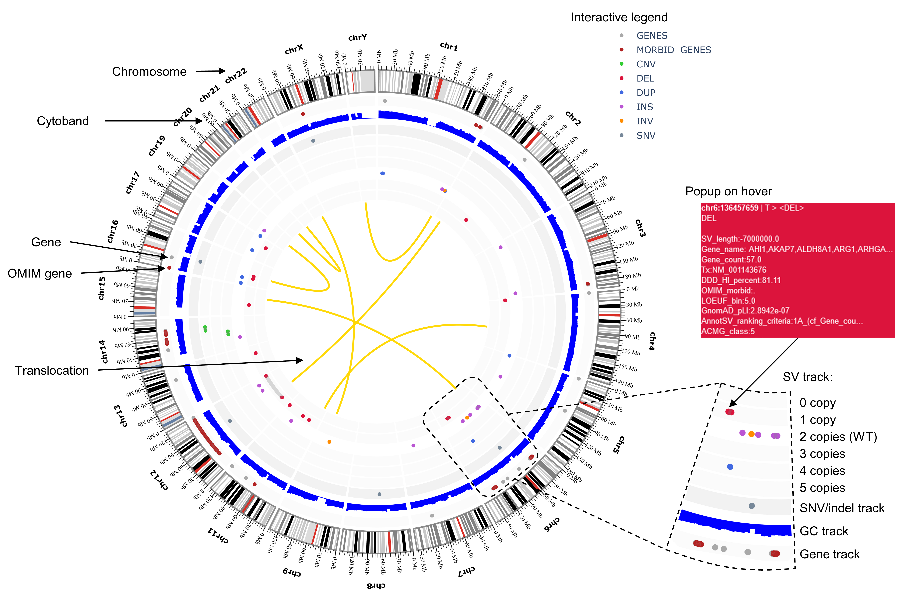

# Introduction

Package vcf2circos is a python package based on Plotly which helps generating Circos plot, from a VCF file or a JSON configuration file.

See documentation and code in [GitHub vcf2circos](https://github.com/bioinfo-chru-strasbourg/vcf2circos).

This package is based on [PCircos](https://github.com/CJinnny/PCircos) code

```
-._    _.--'"`'--._    _.--'"`'--._    _.--'"`'--._    _
    '-:`.'|`|"':-.  '-:`.'|`|"':-.  '-:`.'|`|"':-.  '.` : '.
  '.  '.  | |  | |'.  '.  | |  | |'.  '.  | |  | |'.  '.:   '.  '.
  : '.  '.| |  | |  '.  '.| |  | |  '.  '.| |  | |  '.  '.  : '.  `.
  '   '.  `.:_ | :_.' '.  `.:_ | :_.' '.  `.:_ | :_.' '.  `.'   `.
         `-..,..-'       `-..,..-'       `-..,..-'       `         `

                     __ ___      _
                    / _|__ \    (_)
         __   _____| |_   ) |___ _ _ __ ___ ___  ___
         \ \ / / __|  _| / // __| | '__/ __/ _ \/ __|
          \ V / (__| |  / /| (__| | | | (_| (_) \__ \
           \_/ \___|_| |____\___|_|_|  \___\___/|___/


Author: Jean-Baptiste Lamouche, Antony Le Bechec, Jin Cui
Version: 1.1
Last update: Mars 26 2023


usage: python vcf2circos.py [-h] -i INPUT -o OUTPUT [-e EXPORT] [-p OPTIONS] [-a ASSEMBLY]

optional arguments:
  -h, --help            show this help message and exit
  -i INPUT, --input INPUT
                        Input vcf File
                        VCF SHOULD be multiallelic split to avoid trouble in vcf2circos
                        example: bcftools -m -any <vcf>
                        Format will be autodetected from file path.
                        Supported format:
                           'vcf.gz', 'vcf'
  -o OUTPUT, --output OUTPUT
                        Output file.
                        Format will be autodetected from file path.
                        Supported format:
                           'png', 'jpg', 'jpeg', 'webp', 'svg', 'pdf', 'eps', 'json'
  -e EXPORT, --export EXPORT
                        Export file.
                        Format is 'json'.
                        Generate json file from VCF input file
  -p OPTIONS, --options OPTIONS
                        Options file in json format
  -a ASSEMBLY, --assembly ASSEMBLY
                        Genome assembly to use for now values available (hg19, hg38)
```

<br/>

# Installation

## Git clone and Pip

Download package source files.

```
$ git clone https://github.com/bioinfo-chru-strasbourg/vcf2circos.git .
$ python -m pip install -e .
```

## Docker

Build docker image "vcf2circos:latest"  
From inside cloned repository

```
$ docker image build -t vcf2circos:latest .
```

## Configuration folder
Configuration files could be download here: [vcf2circos-config](http://www.lbgi.fr/~lamouche/vcf2circos/) (do not forget to uncompress tarball). <br><br>

```
tar -xzf <tarballname> <folder>
```
Regarding where you place your configuration folder previously downloaded, you need to specify the absolute path of the Static folder in "Static" json key (which will replace default value)<br><br>

<br/>

# Usage

## Binary 

```
$ vcf2circos --input config/Static/example.vcf.gz --options <jsonfile> --output <outputpath>.html -a <assembly hg19 or hg38>

```

## Docker

```
$ docker run -it --rm vcf2circos:1.1 -i <input.vcf> -o <output.html> -p /Static/options.json -a hg19

```

# Input

This package allows multiple input formats:
- VCF including SNV/InDel/SV (see [VCF specifications](https://samtools.github.io/hts-specs/VCFv4.2.pdf)). Header needs to contain contigs (in order of appearance). See [VCF example](tests/example.vcf).

<br/>

# Output

This package generates Circos plot in multiple formats (html, png, jpg, jpeg, webp, svg, pdf, eps, json):
- HTML file (format with customizable hover text). See [HTML example](docs/refontcircos.html)
- Image files (i.e. png, jpg, jpeg, webp, svg, pdf, eps). See [PNG example](docs/refontcircos.png) and [PDF example](docs/refontcircos.pdf)
- JSON Plotly file (see [Plotly documentation](https://plotly.com/)). 


Output Circos plot sections from a VCF file:



<br/>

# Options 

Circos plot generated from a VCF file can be configured using a JSON options file. See [JSON options example](demo_data/options.example.json).

Here is an example of a JSON options file:
```
{
    "General": {
        "title": "",
        "width": 1000,
        "height": 1000,
        "plot_bgcolor": "white"
    },
    "Static": "<path of config>",
    "Assembly": "hg19",
    "Chromosomes": {
        "list": ["chrX"],
        "all": false
    },
    "Genes": {
        "only_snv_in_sv_genes": false,
        "extend": false
    },
    "Variants": {
        "annotations": {
            "fields": [
                "REF",
                "ALT",
                "Tx",
                "SV_length",
                "SVLEN",
                "END",
                "CN",
                "Gene_name",
                "Gene_count",
                "DDD_HI_percent",
                "OMIM_morbid",
                "GnomAD_pLI",
                "LOEUF_bin",
                "AnnotSV_ranking_criteria",
                "ACMG_class"
            ]
        },
        "rings": {
            "position": 0.5,
            "height": 0.04,
            "space": 0.01,
            "nrings": 6
        }
    },
    "Extra": [
        "gc"
    ],

```

<br/>

## Options format

Exemple of a data tab-delimited file (<b>STILL IN DEV</b>):
Overview of cytoband file, at terms it will be possible to add this kind of data above copy number level rings
```
chr_name  start     end       band_color  band
chr1      0         2300000   gneg        p36.33
chr1      2300000   5400000   gpos25      p36.32
chr1      5400000   7200000   gneg        p36.31
chr1      7200000   9200000   gpos25      p36.23
chr1      9200000   12700000  gneg        p36.22
chr1      12700000  16200000  gpos50      p36.21
chr1      16200000  20400000  gneg        p36.13
chr1      20400000  23900000  gpos25      p36.12
chr1      23900000  28000000  gneg        p36.11
```

<br/>

## General section

The "General" section is a Plotly General section, which configure main options of the Circos plot (e.g. title, size, back-ground color).

Example:
```
"General": {
    "title": "",
    "width": 1000,
    "height": 1000,
    "plot_bgcolor": "white"
}
```

<br/>

## Chromosomes section

The "Chromosomes" section defines information about chromosomes (e.g. contig, list of chromosomes).

Example:
```
"Chromosomes": {
    "list": ["chr7", "chr13", "chr12", "chr14", "chr15", "chrX", "chr1", "chr17"]
}
```


### List of chromosomes

The "list" option define the list of chromosomes to show in the Circos plot. Order of chromosome is still defined in the VCF header (in "contigs" section). If no chromosomes are listed, all chromosomes in the VCF header will be shown.

<br/>

## Genes section

The "Genes" section defines information about Genes (e.g. refGene data, list of genes to show). These information are used to annnotate variants (SNV and SV), and are used with algorithms highlight interesting information (e.g. only SNV on CNV genes). They also can be shown in the Circos plot (below Chromosomes ring)  
only_snv_in_sv_genes: display only snv indels located inside SV boundaries  
extend: display genes located 1Mb in upstream and downstream of SV boundaries

```
    "only_snv_in_sv_genes": true,
    "extend": true
```
### List of genes

The "list" option defines the list of genes to show in the Circos plot, below Chromosomes/Cytoband ring. This list refers to the "gene" column in the data.
<br>
</br>

### Filter SNV on CNV genes

The "only_snv_in_sv_genes" option will select (and show) only SNV that are located on genes mutated with at least 1 SV.


<br/>

## Variants section

The "Variants" section defines varaints annotations to show in each variant hover text, and positions of the varaints rings.

Example:
```
"Variants": {
    "annotations": {
        "fields": ["SVTYPE", "SVLEN"],
    },
    "rings": {
        "position": 0.50,
        "height": 0.04,
        "space": 0.01,
        "nrings": 6
    }
}
```

### Annotations

The "annotations" option defines the annotations of variants to be shown.

The "fields" option configures the list of annotations in the hover text. If empty list if provided getting 15 first annotations in order of appearance in vcf info field. Moreover size of hover annotations is limited to 40 chars.

<br>

### Rings

The "rings" option defines the "position" and "height" of SNV and SV rings, "space" between rings and the number of ring in lightgray to display.


<br/>


# Contacts

 Medical Bioinformatics Applied to Diagnosis - Strasbourg University Hospital - France

[Website](https://www.chru-strasbourg.fr/service/bioinformatique-medicale-appliquee-au-diagnostic-unite-de/)

[GitHub](https://github.com/bioinfo-chru-strasbourg)

[bioinfo@chru-strasbourg.fr](mailto:bioinfo@chru-strasbourg.fr)


